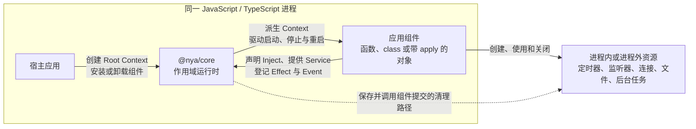
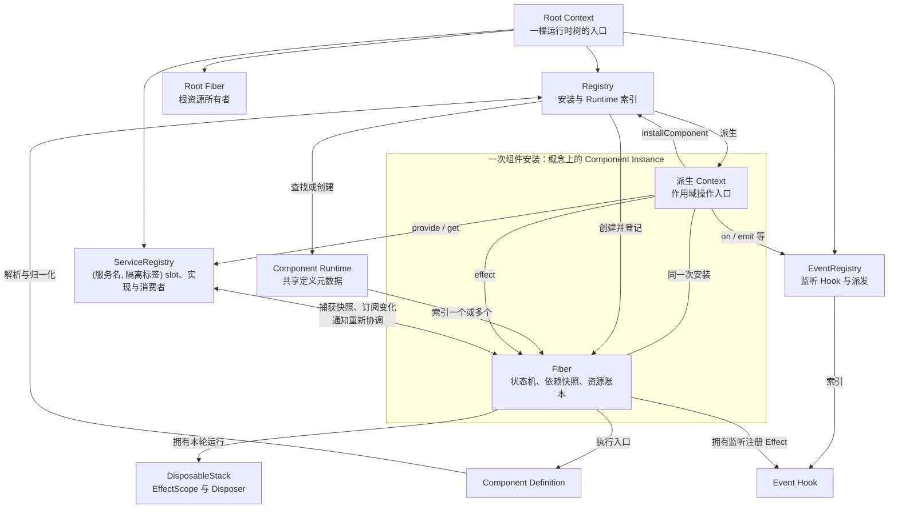
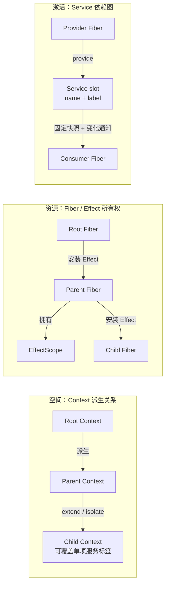
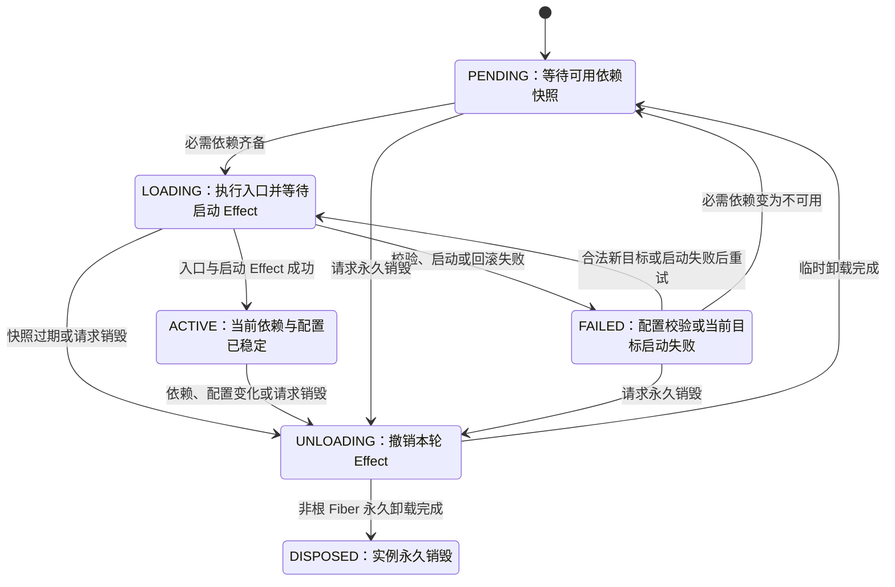
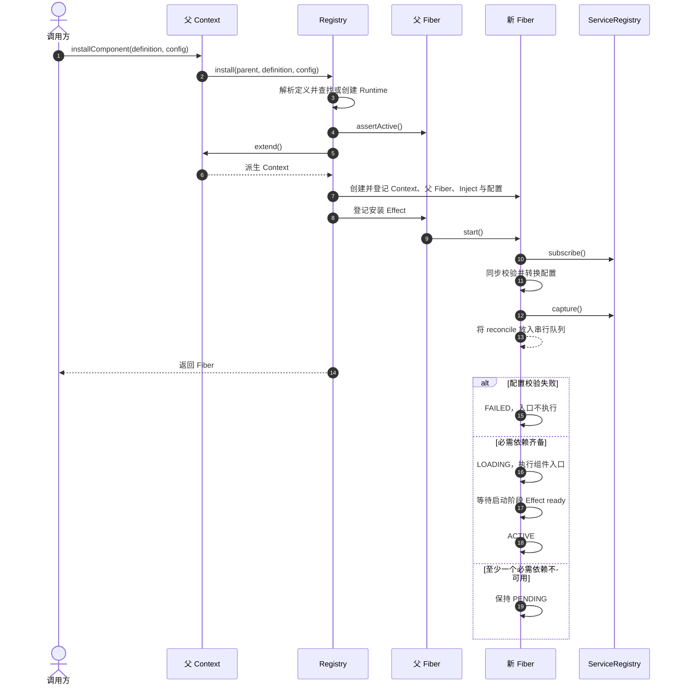
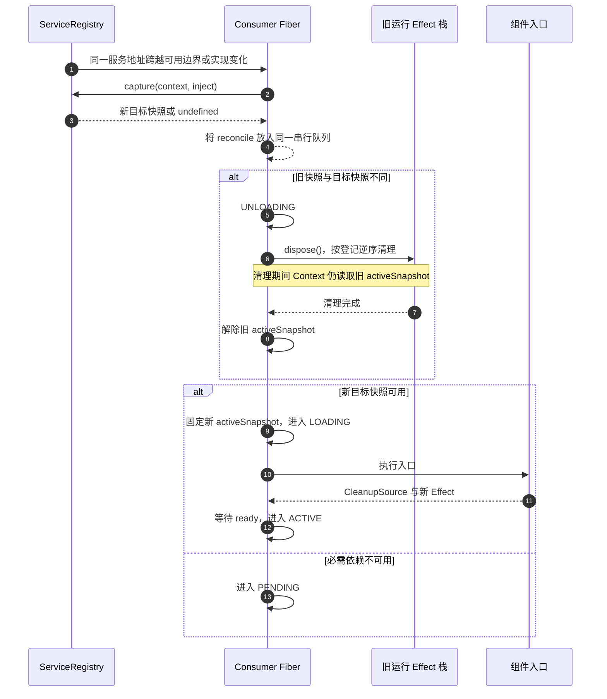
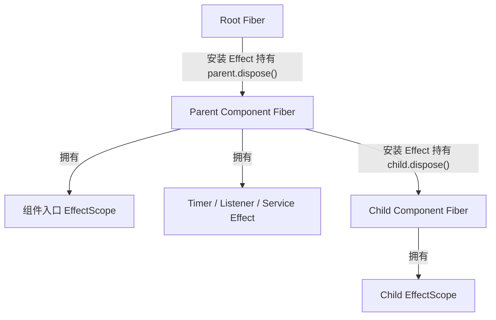

# Nya Core 当前架构总览

> 状态：Current<br>
> 类型：Explanation<br>
> 适用范围：仓库当前已实现的 `@nya/core` 运行时

本文用一组互补视图说明 Nya Core 当前的系统边界、核心构件、运行时关系和必须维持的不变量。它不承担完整 API Reference，也不把[目标设计](./design.md)中尚未实现的能力描述成当前架构。

判断当前行为时，以 `packages/core/src/` 的源码与导出类型、`packages/core/tests/` 的行为测试以及[核心概念指南](./concepts.md)为证据。图中的箭头表达运行时职责或关系，不等同于 TypeScript 文件之间的 import 方向。

## 1. 三十秒理解

Nya Core 是一个嵌入宿主 JavaScript / TypeScript 进程的**作用域组件运行时**：Registry 将可复用的组件定义安装为独立的 Context 与 Fiber；Context 表达组件从哪个服务隔离视图观察和操作运行时，Fiber 管理该组件实例的状态、依赖快照、已校验配置和 Effect；ServiceRegistry 与配置版本共同驱动 Fiber 串行停止和重新启动，所有资源通过 Effect 所有权关系完成失败回滚和级联清理。

可以把核心模型压缩为：

```text
组件实例 = 组件定义 + 本次配置 + 父 Context

组件实例 = Context（在哪里运行）
         + Fiber（运行多久、依赖什么、如何撤销）

组件是否运行 = 必需服务能否形成有效依赖快照

资源生命周期 <= 所属 Fiber 生命周期
```

Component Definition 是可复用蓝图，Component Instance 是一次安装结果。当前代码没有单独的 `ComponentInstance` class；一次实例由相互关联的派生 Context 和 Fiber 共同表示。

## 2. 系统边界

下面是 Nya Core 的 C4 System Context 级视图。Core、宿主应用和组件都运行在同一个 JavaScript 进程中；Nya Core 不是远程服务，也不提供进程级隔离。



当前边界有三点需要明确：

- Core 接收宿主已经提供的组件定义，不负责发现、导入或热替换模块；
- Core 管理资源的生命周期协议，但不实现数据库、网络或业务服务本身；
- Context 是进程内作用域协议，不是权限、安全或进程沙箱。

Loader、配置文件、HMR、控制台输出和分布式生命周期不属于当前 `@nya/core`。

## 3. 核心构件

每个 Root Context 建立一棵独立运行时树，并创建根 Fiber、Registry、ServiceRegistry 和 EventRegistry。派生 Context 通过原型链共享这些根级构件；由组件安装产生的 Context 会用本次安装对应的 Fiber 覆盖继承值。



| 构件 | 当前职责 | 关键证据 |
| --- | --- | --- |
| Context | 创建、派生和隔离作用域；把安装、Effect、Service 和 Event 操作委托给对应构件 | [`context.ts`](../packages/core/src/context.ts) |
| Component 解析 | 接受函数、构造器或带 `apply` 的对象；归一化入口、名称和 Inject | [`component.ts`](../packages/core/src/component.ts) |
| Registry / Component Runtime | 把定义安装为 Context + Fiber；按入口引用索引同一定义产生的 Fiber | [`registry.ts`](../packages/core/src/registry.ts) |
| Fiber | 串行协调单次安装的启动、临时卸载、重启和永久销毁；固定本轮依赖快照 | [`fiber.ts`](../packages/core/src/fiber.ts) |
| DisposableStack / EffectScope | 收集 CleanupSource；提供幂等、后进先出、失败回滚和聚合错误清理 | [`disposable.ts`](../packages/core/src/disposable.ts) |
| ServiceRegistry / Service | 注册具名服务、捕获依赖快照、维护反向订阅并通知消费者 | [`service.ts`](../packages/core/src/service.ts) |
| EventRegistry | 保存带订阅 Context 的 Hook，提供多模式派发和作用域过滤 | [`events.ts`](../packages/core/src/events.ts) |
| 协议 Symbol | 支持 Context 识别、事件过滤和 Service 生命周期协议 | [`symbols.ts`](../packages/core/src/symbols.ts) |

`index.ts` 是公共 API 边界；某个内部类存在不代表它一定是稳定契约，实际导出以 [`packages/core/src/index.ts`](../packages/core/src/index.ts) 为准。

## 4. 四个互补的运行时视图

不能只用一棵“组件树”解释 Nya Core。当前运行时同时存在四种含义不同的关系：

1. Context 派生关系表达空间与能力入口；
2. Fiber 状态表达组件实例在时间上的运行阶段；
3. Service 依赖图决定 Fiber 何时能够运行以及何时需要重启；
4. Effect 所有权关系决定资源何时以及以什么顺序撤销。

下面三张并列的小图展示最容易混淆的结构关系：



这些边不能互相替换：

- 手动 `context.extend()` 可以产生新 Context，却不会创建新 Fiber；
- 服务消费者可以依赖另一分支提供的能力，依赖边不等于父子所有权；
- Service 变化只负责触发生命周期协调，最终资源清理仍由 Fiber 的 Effect 栈执行；
- Event 是独立的多对多通信面，但每个监听器注册仍作为 Effect 归订阅方 Fiber 所有。

因此，“空间—时间—依赖—资源”比传统的分层或类继承图更能表达 Nya Core 的核心架构。

## 5. Fiber 生命周期状态机

普通 Fiber 创建后从 PENDING 开始。每个 Fiber 使用自己的 Promise 队列串行协调依赖快照和配置版本，因此同一个实例不会同时启动和卸载。



根 Fiber 是特例：它初始为 ACTIVE；调用根 Fiber 的 `dispose()` 会清空当前资源树，然后建立新的空 Effect 栈并回到 ACTIVE，使 Root Context 可以继续安装组件。

`await fiber` 表示等待最近登记且在等待期间继续追加的生命周期转换达到稳定状态，不表示等待组件永久结束。

## 6. 关键运行时流程

### 6.1 安装组件

安装过程先同步建立实例身份和所有权，再异步协调依赖与启动。`installComponent()` 返回 Fiber 时，组件可能仍处于 PENDING 或 LOADING；调用方可以 `await fiber` 等待其稳定。



Registry 把“启动子 Fiber，并在清理时调用其 `dispose()`”登记为父 Fiber 的 Effect。这一步建立父子组件的级联卸载关系。

### 6.2 服务变化驱动重新协调

ServiceRegistry 先按消费者 Context 把每个依赖名解析为 `(服务名, 隔离标签)` 地址，再用捕获到的实现 id 组成依赖 epoch。隔离地址严格匹配，没有实现时不会回退默认 slot。消费者一轮运行期间固定使用同一份快照；即使服务变化，旧快照也会一直保留到旧运行清理完成。



新的服务变化即使发生在异步清理期间，也只会更新目标快照并追加协调任务，不会与当前卸载并发。最终状态应收敛到最新依赖快照。

### 6.3 资源所有权与清理

Nya Core 的资源安全不是依靠组件自行维护多份退出路径，而是依靠 Fiber 与 Effect 形成的所有权关系：



清理协议满足：

- EffectScope 在执行资源创建前先登记到所有者，启动中途失败也能找到回滚路径；
- 同一栈按后进先出顺序清理，适配“后创建资源依赖先创建资源”的常见关系；
- Disposer 是幂等的，多次调用不会重复释放同一资源；
- 一个清理失败不会阻止其余独立清理尝试，多个错误使用 `AggregateError` 汇总；
- 事件 Hook、服务注册和子组件安装都通过 Effect 接入同一清理模型。

## 7. 架构不变量

下列不变量比具体类字段或文件布局更稳定，架构变更必须通过源码和测试继续证明它们：

1. 每次普通组件安装恰好创建一个派生 Context 和一个新 Fiber。
2. Component Runtime 是定义级索引，不能与一次安装产生的实例混为一体。
3. 同一个 Fiber 的启动、临时卸载、配置更新、重启和永久销毁必须串行执行。
4. 一轮运行只读取该 Fiber 固定的依赖快照和配置；清理旧运行时不能提前切换到新目标。
5. 重新执行组件入口前，旧运行产生的 Effect 必须完成清理。
6. 每个 Effect 必须有明确且唯一的 Fiber 或外层 Effect 所有者。
7. 子 Fiber 的生命周期不能长于安装它的父 Fiber。
8. 启动失败必须回滚本轮已经登记的资源、服务和监听器。
9. 多次 `dispose()` 不能重复释放同一资源，单个清理失败不能阻止其余清理尝试。
10. Context 派生不能修改父 Context，也不能替换根、Registry、ServiceRegistry、EventRegistry 或 Fiber 等核心引用。
11. 服务地址必须同时包含 Root、服务名和隔离标签；缺失隔离实现时不能回退默认地址。

这些行为分别由[生命周期测试](../packages/core/tests/lifecycle.spec.ts)、[服务依赖测试](../packages/core/tests/service.spec.ts)、[服务隔离测试](../packages/core/tests/isolation.spec.ts)和[事件测试](../packages/core/tests/events.spec.ts)覆盖。完整概念解释见[核心概念指南](./concepts.md)。

## 8. 当前实现与目标设计的边界

架构图只画当前能够从源码和测试证明的构件。目标设计可以指导演进，但不能反向证明现有功能。

| 领域 | 当前架构 | 仍属目标设计 |
| --- | --- | --- |
| Component | 函数、class、对象定义；每次安装独立 Context 与 Fiber | Loader、模块发现与 HMR |
| Config | 同步 Standard Schema 校验与转换；`fiber.config`、`update()`、`restart()` 与快速更新收敛 | Loader 读写、配置文件持久化与 HMR |
| Service | `(服务名, 隔离标签)` 严格寻址；Inject 快照按地址驱动消费者启停；最小 `Service` 基类、`init` 与 `check` | Context 拦截、调用方追踪、callable Service 与 mixin |
| Effect | CleanupSource、失败回滚、幂等 LIFO 清理和聚合错误 | 可观察的 Effect 诊断树与更完整调试工具 |
| Event | 生命周期绑定、Context 过滤和五种派发模式 | Service 作为 `thisArg` 时结合调用方隔离标签过滤 |
| 包边界 | 当前只有 `@nya/core` 和 playground | `@nya/loader`、`@nya/hmr` 等外围包 |

目标语义、非目标和建议的后续包见[核心设计](./design.md)。其中标记为 Proposed 的内容应在图中使用虚线或 `«proposed»`，并与本文的 Current 视图分开维护。

## 9. 维护与追溯

| 要确认的事实 | 首选证据 |
| --- | --- |
| 当前公共 API | [`packages/core/src/index.ts`](../packages/core/src/index.ts) 与导出类型 |
| 当前可观察行为 | `packages/core/src/`、`packages/core/tests/`、[核心概念指南](./concepts.md) |
| 当前架构关系 | 上述实现证据与本文 |
| 目标架构和未来约束 | 状态明确的[核心设计](./design.md) |
| 为什么接受某项跨模块决策 | [ADR 索引](./adr/README.md)中的对应记录 |

公共 API、生命周期、依赖解析、资源所有权或包边界发生变化时，应在同一变更中更新相应测试、核心概念和本文中的受影响视图。新的跨模块架构决策应新增 ADR，而不是只修改一张图。
