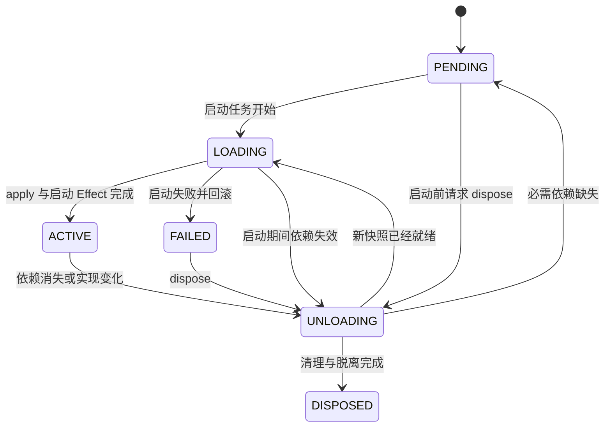

# Nya Core 核心概念指南

> 状态：Current<br>
> 类型：Explanation<br>
> 适用范围：仓库当前已实现的阶段二运行时<br>
> 对应包：`@nya/core`

本文解释 Nya Core 当前代码中的核心概念、概念之间的关系，以及这些概念在生命周期中的实际行为。它面向第一次阅读代码的开发者，也可以作为编写组件时的心智模型。

本文只把已经落地并有源码或测试支撑的行为写成“当前语义”。Service、Inject 和动态依赖已经可用；Event、配置 Schema、服务隔离、拦截和热重载等能力仍属于后续设计目标，详见 [核心设计](./design.md)。

## 1. 一句话理解 Nya Core

Nya Core 是一个**由动态服务依赖驱动，并能追踪组件副作用、完整撤销和重新建立运行的作用域运行时**。

一次组件安装可以概括为：

```text
组件定义 + 本次配置 + 父 Context
                ↓
          Registry 安装
                ↓
     派生 Context + 独立 Fiber
                ↓
       执行 apply() 并登记 Effect
```

其中：

- Component Definition 说明“要运行什么”；
- Context 说明“从哪里运行，并通过哪个作用域操作运行时”；
- Fiber 说明“这一次安装处于什么状态、能运行多久”；
- Effect 说明“创建了什么资源，以及以后如何撤销”；
- Registry 负责把组件定义安装为实例，并索引同一定义产生的 Fiber。

最重要的区分是：

> 组件定义是可复用蓝图；组件实例是蓝图被安装一次后的运行结果。

同一个组件定义可以安装多次。每次安装都会得到新的 Context 和 Fiber，因此拥有独立配置、状态和资源。

## 2. 概念总览

| 概念 | 简短定义 | 生命周期范围 | 当前代码中的表示 |
| --- | --- | --- | --- |
| Component Definition | 可重复安装的组件蓝图 | 跨多次安装复用 | 函数、class 或带 `apply` 的对象 |
| Component Instance | 某个定义使用一份配置安装一次的运行结果 | 从安装到卸载 | 一对 Context 与 Fiber；没有单独的实例类 |
| Context | 当前实例使用运行时能力的作用域入口 | 通常与组件实例相同 | `Context` |
| Fiber | 单次安装的生命周期控制器和 Effect 所有者 | 从 PENDING 到 DISPOSED | `Fiber` |
| Effect | 一次资源创建以及与之配对的撤销操作 | 不长于所属 Fiber | `EffectScope` |
| Disposer | 执行撤销操作的函数 | 可被手动或自动调用 | `() => void \| Promise<void>` |
| CleanupSource | 组件或 Effect 向运行时提交清理方法的协议 | 在启动阶段被收集 | 空值、Disposer、Promise 或迭代器 |
| Registry | 组件 Runtime 与 Fiber 的根级索引 | 与根 Context 相同 | `Registry` |
| Component Runtime | 同一个组件入口共享的运行元数据 | 存在实例时有效 | `ComponentRuntime` |
| Root Context | 一棵运行时树的入口 | 可反复安装和清空组件 | `new Context()` |

下面分别解释这些概念。

## 3. Component Definition：可复用的组件蓝图

### 3.1 定义

Component Definition 是一段**描述组件如何启动、使用什么配置以及如何清理**的可复用声明。它本身不是正在运行的组件，也不应保存某一次安装独有的生命周期状态。

Nya Core 参考 Cordis，接受函数、class 和带 `apply` 的对象三种形式：

```ts
import type { Component, Context } from '@nya/core'

interface WorkerConfig {
  interval: number
}

export const objectComponent: Component.Object<WorkerConfig> = {
  name: 'worker',

  apply(context, config) {
    // 在这里启动本次组件实例。
    // 返回值用于描述如何撤销本次启动。
  },
}

export const functionComponent: Component.Function<WorkerConfig> = (
  context,
  config,
) => {
  // 启动逻辑；可以直接返回 CleanupSource。
}

export class ClassComponent {
  constructor(context: Context, config: WorkerConfig) {
    // class 构造器的返回值不参与清理收集；资源应通过 context.effect() 登记。
  }
}
```

缺少可调用 `apply` 的对象以及其他非函数值不是合法 Component。安装这些值时，`resolveComponent()` 会立即抛出 `TypeError`。

构造器判定沿用 Cordis 规则：具有 `prototype` 的普通函数按构造器通过 `new` 执行；箭头函数、async 函数、生成器和异步生成器按函数直接调用。因此，需要直接返回 CleanupSource 时，函数 Component 应使用后四种形式之一。

### 3.2 `name` 的含义

`name` 是面向日志、错误信息和调试工具的人类可读标识。函数和 class 默认使用 JavaScript 自带的函数名；对象可以显式提供 `name`。名称缺失或恰好为 `apply` 时，当前 Fiber 显示为 `anonymous`。它不是组件实例编号，也不保证全局唯一。多个组件定义可以使用相同名称，同一个定义的多次安装也会共享名称。

因此，不能只靠 `name` 判断两个 Fiber 是否代表同一次安装。

### 3.3 组件入口的含义

函数本身、对象的 `apply` 方法或 class 构造器是组件实例的启动入口：

- `context` 是专属于本次安装的派生 Context；
- `config` 是本次调用 `ctx.installComponent(component, config)` 传入的值；
- 函数和对象 `apply` 的返回值是 CleanupSource，用于登记本次启动对应的清理操作；
- class 通过 `new Constructor(context, config)` 启动，构造结果不会作为 CleanupSource；构造期间调用的 `context.effect()` 仍归本次 Fiber 所有。

当前实现只在 TypeScript 类型层面约束配置，不执行运行时 Schema 校验或转换。组件若要求配置存在或满足某些条件，需要暂时自行检查。

### 3.4 定义不是实例

下面两次安装使用同一个定义，但会产生两个互不相同的 Fiber、Context 和配置：

```ts
const first = app.installComponent(workerComponent, { interval: 1000 })
const second = app.installComponent(workerComponent, { interval: 5000 })

await Promise.all([first, second])

first !== second
first.context !== second.context
```

卸载 `first` 不应直接卸载 `second`。如果希望卸载某个定义当前产生的全部实例，可以使用根 Registry 的 `delete(component)`。

### 3.5 当前的 Runtime 身份

Registry 当前以归一化后的入口引用作为 Component Runtime 的键：函数和 class 使用自身，对象使用 `apply`。因此，两个对象如果复用同一个 `apply` 函数，会被视为共享 Runtime 元数据。Runtime 的名称取第一次建立该 Runtime 时读取到的名称。

这是当前实现的身份规则，不等于“任意同名组件都是同一个组件”。如果组件需要独立 Runtime，应使用不同的 `apply` 函数引用。

## 4. Component Instance：一次安装的运行结果

Component Instance 是一个概念实体，表示“某个组件定义使用某份配置安装了一次”。当前代码没有导出名为 `ComponentInstance` 的 class；一个实例由互相关联的两个对象共同表示：

```text
Component Instance
├── Context：本次安装使用的作用域入口
└── Fiber：本次安装的状态和资源所有者
```

这两个对象职责不同，不能互相替代：

- Context 面向组件代码，提供 `installComponent()`、`effect()` 等运行时操作；
- Fiber 面向生命周期，提供 `state`、`error`、`dispose()` 和等待能力。

`ctx.installComponent()` 的返回值是 Fiber，而传给函数、`apply()` 或 class 构造器的值是该 Fiber 对应的 Context。

## 5. Context：作用域入口

### 5.1 定义

Context 是组件代码观察和操作 Nya 运行时的入口。当前阶段它主要负责：

- 标识一棵运行时树的根；
- 保存或继承当前 Registry；
- 指向当前 Fiber；
- 派生子 Context；
- 把组件安装委托给 Registry；
- 把 Effect 登记委托给当前 Fiber。

可以把 Context 理解为“带作用域的操作句柄”，而不是生命周期状态机。Context 自己不决定组件何时进入 ACTIVE，也不直接保存完整的资源栈；这些职责属于 Fiber。

### 5.2 Root Context

`new Context()` 创建一棵独立运行时树的根：

```ts
import { Context } from '@nya/core'

const app = new Context()
```

根 Context 会创建：

- 一个根 Registry；
- 一个根 Fiber；
- 指向自身的 `root`。

根 Fiber 没有对应的普通组件定义，名称为 `<root>`，稳定状态为 ACTIVE。安装在根 Context 上的组件会成为根 Fiber 拥有的资源。

调用 `app.fiber.dispose()` 会清理当前组件树，但根 Context 本身仍可继续使用。清理完成后，根 Fiber 会重新回到 ACTIVE，并建立新的空 Effect 栈。

### 5.3 派生 Context

`context.extend()` 使用 JavaScript 原型链创建子 Context：

```text
Root Context
    ↑ prototype
Parent Component Context
    ↑ prototype
Child Component Context
```

派生不是复制。子 Context 会从父 Context 继承未覆盖的属性，因此：

- 所有后代看到同一个 `root`；
- 所有后代默认共享根 Registry；
- 框架以后添加到父 Context 的 getter、Symbol 或方法仍可被后代观察；
- 在子 Context 上添加普通扩展不会修改父 Context。

`extend(extension)` 会保留扩展对象的属性描述符，因此 getter、setter、不可写属性和 Symbol 属性不会被简单展开为普通值。

以下核心属性禁止通过扩展对象覆盖：

- `root`；
- `registry`；
- `services`；
- `fiber`；
- Context 的协议 Symbol。

每次安装普通组件时，Registry 会先从父 Context 派生新 Context，再在新 Context 上定义只读的本次 Fiber。

### 5.4 Context 识别

`Context.is(value)` 不只依赖 `instanceof`，而是检查：

```ts
Symbol.for('@nya/core/context')
```

这个全局 Symbol 让同一 JavaScript 进程中的多个 `@nya/core` 包副本可以共享 Context 识别协议。

该标记只是运行时互操作协议，不是安全机制。具有任意 JavaScript 执行能力的代码可以伪造属性；Context 也不构成进程或权限沙箱。

### 5.5 Service 与 Inject

`ctx.provide(name, value)` 把一个具名能力注册为当前 Fiber 本轮运行拥有的 Effect。消费者可以在 Component 上声明必需依赖：

```ts
const consumer = {
  inject: ['database'],
  apply(ctx: Context) {
    return ctx.database.start()
  },
}
```

也可以使用等价的轻量入口：

```ts
ctx.inject(['database'], (ctx) => {
  return ctx.database.start()
})
```

缺少任意必需服务时，Fiber 保持 `PENDING`，入口不会执行。服务提供方进入 `ACTIVE` 后，消费者捕获一份固定服务快照并启动；服务移除或实现发生变化时，消费者先使用旧快照完成清理，再用最新快照重新启动或回到 `PENDING`。

普通组件只能通过 `ctx.database` 或 `ctx.get('database')` 读取已经声明在 `inject` 中的服务；未声明访问会抛错。根 Context 可以读取当前有效服务，提供方也可以在自己的初始化过程中读取自己刚注册的服务。

当前所有 Context 仍共享同名服务的默认 slot，同一名称只能注册一个实现。服务隔离、拦截配置、调用方 Context 追踪、callable Service 和 mixin 尚未实现。

## 6. Fiber：单次安装的生命周期控制器

### 6.1 定义

Fiber 表示组件定义的**某一次具体安装**。它负责：

- 保存本次安装的 Context、父 Fiber、配置和 Runtime；
- 根据服务快照串行执行启动、临时卸载与重新激活；
- 暴露当前状态和启动错误；
- 拥有本次运行产生的 Effect；
- 在永久 `dispose()` 后从 Registry 脱离；
- 让调用方等待当前生命周期转换稳定。

组件定义可以复用，但 Fiber 不复用。每次 `ctx.installComponent()` 都会创建一个新 Fiber。

### 6.2 生命周期状态

| 状态 | 当前含义 |
| --- | --- |
| `PENDING` | Fiber 已创建并等待协调，或当前缺少至少一个必需服务 |
| `LOADING` | 正在执行组件入口，或等待启动期间创建的 Effect 准备完成 |
| `ACTIVE` | 本次启动已经成功并达到稳定状态 |
| `UNLOADING` | 正在撤销该 Fiber 拥有的 Effect |
| `FAILED` | 组件启动失败，或启动失败后的回滚也出现错误 |
| `DISPOSED` | 非根组件已经永久卸载 |

当前普通组件的主要转换是：



`dispose()` 请求会让普通 Fiber 在清理后进入 `DISPOSED`；依赖变化触发的卸载只销毁当前运行作用域，Fiber 本身及其依赖订阅仍然保留，因此可以重新进入 `LOADING`。

### 6.3 生命周期串行化

每个 Fiber 都有自己的 Promise 队列。启动和卸载操作进入同一队列，因此同一个 Fiber 不会同时执行两次生命周期转换。

如果组件仍在异步启动时调用 `dispose()`：

1. Fiber 先记录卸载请求；
2. 已进入队列的启动过程完成或失败；
3. 卸载过程随后执行；
4. 已登记资源被清理；
5. 非根 Fiber 最终进入 DISPOSED。

这避免了启动逻辑和清理逻辑同时修改同一组资源。

### 6.4 Thenable Fiber

Fiber 实现了 `PromiseLike<void>`，因此可以直接等待：

```ts
const fiber = app.installComponent(workerComponent, config)
await fiber
```

`await fiber` 的准确含义是：

> 等待最近一次已经登记的生命周期转换完成。

它不是“等待组件永久结束”，也不会返回 Fiber 自身。直接返回自身会触发 Promise 对 thenable 的递归解析，因此成功结果刻意设计为 `void`。

如果启动失败，等待 Fiber 会拒绝，错误也会保存在 `fiber.error` 中。调用方应在需要时捕获这个拒绝。

### 6.5 主动卸载

```ts
await fiber.dispose()
```

普通 Fiber 的卸载包括：

1. 进入 UNLOADING；
2. 按规则清理所有 Effect；
3. 从 Component Runtime 的 Fiber 集合中移除；
4. 进入 DISPOSED；
5. 如果清理发生错误，在状态收敛后向调用方拒绝 Promise。

`dispose()` 是幂等的。多次调用返回同一个卸载任务，不会重复释放资源。

## 7. Effect：资源创建与撤销的配对单元

### 7.1 定义

Effect 是一次**会对运行环境造成变化、并且需要在以后撤销**的操作。典型资源包括：

- 定时器；
- 事件监听器；
- 文件或网络连接；
- 子组件；
- 临时注册项；
- 后台任务。

Effect 不是“发生过的事件”，也不是 React 的 `useEffect` API。这里的核心含义是资源所有权：创建资源时就把撤销方法交给所属 Fiber。

### 7.2 登记 Effect

```ts
const stopTimer = context.effect(() => {
  const timer = setInterval(run, 1000)

  return () => {
    clearInterval(timer)
  }
}, 'worker.timer')
```

`context.effect(execute, label?)` 的行为是：

1. 确认当前 Fiber 处于 LOADING 或 ACTIVE；
2. 创建新的 EffectScope；
3. 先把 EffectScope 登记给当前 Fiber，或当前同步执行中的外层 Effect；
4. 在组件启动期间，把它加入需要等待的 scope 列表；
5. 立即执行 `execute`；
6. 收集 `execute` 返回的 CleanupSource；
7. 返回一个幂等 Disposer。

`label` 不影响资源行为，主要用于未来的诊断和 Effect 树展示。建议使用能够说明资源来源的稳定名称，例如 `worker.polling-timer`。

### 7.3 Effect 所有权

每个 Effect 都必须属于创建它的 Fiber，或嵌套在该 Fiber 的另一个 Effect 中：

```text
Fiber
└── EffectScope
    ├── Disposer
    └── nested EffectScope
        └── Disposer
```

组件启动期间同步创建的内层 Effect 会挂到当时正在执行的外层 EffectScope。跨越异步边界后创建的 Effect 仍会被启动中的 Fiber 跟踪和等待，但当前实现不会保存通用的异步调用上下文。

无论层级如何，只要最终属于该 Fiber，Fiber 卸载时就会清理它。

### 7.4 为什么创建时就登记清理

把清理逻辑与资源创建写在同一个位置，可以避免以下问题：

- 启动中途抛错后，不知道已经创建了哪些资源；
- 组件被父组件卸载时遗漏局部资源；
- 多个退出路径分别维护不同的清理列表；
- 手动停止和框架停止重复执行同一个撤销操作。

EffectScope 会在初始化失败时回滚已经收集到的清理函数。因此，“启动没有完成”不等于“启动没有产生副作用”。

## 8. CleanupSource 与 Disposer：统一清理协议

### 8.1 Disposer

Disposer 是最基本的清理函数：

```ts
type Disposer = () => void | Promise<void>
```

它可以同步或异步完成。运行时会把登记到 DisposableStack 的 Disposer 包装为幂等函数：第一次调用启动清理，之后的调用复用同一个 Promise。

### 8.2 CleanupSource

函数 Component、对象 Component 的 `apply()` 和 Effect 创建函数可以返回以下形式：

| 返回形式 | 含义 |
| --- | --- |
| `undefined` 或 `null` | 没有额外清理操作 |
| `Disposer` | 登记一个同步或异步清理函数 |
| `PromiseLike<Cleanup>` | 异步得到一个清理函数或空值 |
| `Iterable<Cleanup>` | 同步逐项提供清理函数 |
| `AsyncIterable<Cleanup>` | 异步逐项提供清理函数 |

例如，一个组件可以异步初始化后返回清理函数：

```ts
const component: Component = {
  name: 'connection',

  async apply() {
    const connection = await openConnection()
    return () => connection.close()
  },
}
```

也可以通过生成器登记多项清理：

```ts
const component: Component = {
  name: 'multiple-resources',

  *apply() {
    const first = acquireFirst()
    yield () => first.release()

    const second = acquireSecond()
    yield () => second.release()
  },
}
```

普通对象、数字和字符串不是合法 CleanupSource。运行时遇到这些返回值会抛出 `TypeError`，并触发已登记资源的回滚。

### 8.3 清理顺序

DisposableStack 使用后进先出顺序：

```text
创建：A → B → C
清理：C → B → A
```

这与嵌套资源的常见依赖关系一致：后创建的资源通常依赖先创建的资源，因此应先撤销。

组件入口自身也是一个 EffectScope。入口返回的清理函数和入口中创建的 Effect 会一起进入其所有权树，并遵守当前栈中的后进先出顺序。

### 8.4 清理错误

一个 Disposer 失败不会阻止同一个 DisposableStack 继续清理其他独立资源：

- 只有一个清理失败时，最终重新抛出该错误；
- 多个清理失败时，最终抛出 `AggregateError`；
- 启动失败且回滚也失败时，`AggregateError` 同时保留启动错误与清理错误。

因此，`dispose()` 的 Promise 可能拒绝，但这不表示后续资源没有被尝试清理。

## 9. DisposableStack 与 EffectScope：清理协议的底层构件

这两个类型目前从 `@nya/core` 公开导出，但通常组件作者优先使用 `context.effect()`。

### 9.1 DisposableStack

DisposableStack 是一组 Disposer 的幂等、后进先出容器：

- `add(disposer)` 登记并返回包装后的幂等 Disposer；
- `dispose()` 清空整个栈；
- 栈开始清理后不能再加入新 Disposer；
- 重复 `dispose()` 会复用第一次清理任务。

它只管理“怎么清理”，不负责组件状态。

### 9.2 EffectScope

EffectScope 在 DisposableStack 之上增加“执行一次资源创建函数并收集其 CleanupSource”的能力：

- 一个 scope 只能 `start()` 一次；
- `ready` 表示异步 CleanupSource 是否已经收集稳定；
- `dispose` 会先等待初始化结束，再清理资源；
- 初始化失败时会自动回滚已经收集到的资源。

Fiber 使用 EffectScope 把组件入口和普通 `context.effect()` 统一到同一种资源协议中。

## 10. Registry 与 Component Runtime：定义和实例的索引

### 10.1 Registry

每个 Root Context 创建一个 Registry，派生 Context 通过原型链共享它。Registry 的职责是：

- 校验并解析 Component Definition；
- 为一次安装创建派生 Context 和 Fiber；
- 维护 Component Runtime；
- 记录同一 Runtime 当前拥有的全部 Fiber；
- 在父 Fiber 中登记子 Fiber 的卸载操作；
- 按组件定义查询或批量卸载实例。

Registry 不执行组件业务逻辑。真正调用函数 / `apply()` 或实例化 class 的是 Fiber。

### 10.2 Component Runtime

Component Runtime 是组件定义和组件实例之间的一层共享元数据：

```ts
interface ComponentRuntime {
  name?: string
  kind: 'function' | 'constructor'
  callback: Component.Callback
  fibers: Set<Fiber>
}
```

它不是组件实例。一个 Runtime 可以同时关联多个 Fiber：

```text
Component Runtime
├── Fiber #1 + Context #1 + Config #1
├── Fiber #2 + Context #2 + Config #2
└── Fiber #3 + Context #3 + Config #3
```

最后一个 Fiber 卸载并从集合移除后，当前实现会自动删除空闲 Runtime。

### 10.3 安装流程

`parentContext.installComponent(definition, config)` 当前会依次完成：

1. 校验并归一化函数、class 或带 `apply` 的对象定义；
2. 确认父 Fiber 仍可创建 Effect；
3. 查找或创建 Component Runtime；
4. 从父 Context 派生组件 Context；
5. 创建本次安装的 Fiber；
6. 把新 Fiber 加入 Runtime 的实例集合；
7. 把“启动并在以后卸载这个 Fiber”登记为父 Fiber 的 Effect；
8. 返回新 Fiber。

步骤 7 是父子组件级联卸载成立的关键。

### 10.4 批量卸载

```ts
await app.registry.delete(workerComponent)
```

`delete(component)` 会查找该定义当前的 Runtime，并并行调用其中所有 Fiber 的 `dispose()`。它针对的是这个定义当前产生的全部实例，而不是只卸载最近一次安装。

## 11. 所有权树与级联卸载

Nya Core 的资源安全来自一棵所有权树：

```text
Root Fiber
└── Parent Component Fiber
    ├── Parent Effect
    ├── Timer Effect
    └── Child Component Fiber
        └── Child Effect
```

这里的核心规则是：

> 子组件被当作父 Fiber 的一个可撤销 Effect。

因此，父组件不需要额外保存一份“所有子组件”列表来手动清理。安装子组件时，Registry 已经把子 Fiber 的 `dispose()` 登记到父 Fiber；父 Fiber 卸载时会自然触发子 Fiber 卸载。

这保证了：

- 子组件的生命周期不会长于创建它的父组件实例；
- 根 Fiber 清理时可以级联清理整棵组件树；
- 启动失败时，已经安装的子组件也能沿 Effect 所有权回滚；
- 每个资源都有明确且唯一的生命周期所有者。

## 12. 完整示例

下面的例子只使用当前已经实现的 API：

```ts
import { Context } from '@nya/core'
import type { Component } from '@nya/core'

interface PollerConfig {
  interval: number
}

const poller: Component<PollerConfig> = {
  name: 'poller',

  apply(context, config) {
    if (!config || config.interval <= 0) {
      throw new RangeError('poller requires a positive interval')
    }

    let count = 0

    context.effect(() => {
      const timer = setInterval(() => {
        count += 1
      }, config.interval)

      return () => clearInterval(timer)
    }, 'poller.timer')

    return () => {
      console.log('poller stopped after', count, 'ticks')
    }
  },
}

const app = new Context()
const fiber = app.installComponent(poller, { interval: 1000 })

// 等待 apply() 及启动期间的异步 Effect 达到稳定状态。
await fiber

// fiber.state 现在是 ACTIVE。

// 清理组件入口返回的 Disposer 和 timer Effect。
await fiber.dispose()

// fiber.state 现在是 DISPOSED。
```

如果 `apply()`、异步初始化或 CleanupSource 收集失败，`await fiber` 会拒绝，已经成功登记的资源会先被回滚。

## 13. 常见混淆

### 13.1 Component 与 Fiber

Component 是定义，Fiber 是一次安装。把状态保存在可复用 Component 定义上，会让多次安装意外共享状态；安装独有状态应放在入口局部变量、配置、class 实例或由该 Fiber 拥有的资源中。

### 13.2 Context 与 Fiber

Context 是操作运行时的作用域入口，Fiber 是生命周期和资源账本。`context.fiber` 指向当前实例，但二者不是同一个对象。

### 13.3 Effect 与 Event

Effect 表示需要撤销的副作用；Event 表示一件事情已经发生。当前代码已经实现 Effect，尚未实现设计中的 Event 系统。

### 13.4 `await fiber` 与组件退出

`await fiber` 等待当前启动、依赖协调或卸载任务稳定，不表示组件已经退出。启动成功后，Fiber 通常处于 ACTIVE；依赖失效会让它清理并回到 PENDING，`dispose()` 或父 Fiber 清理才会永久销毁它。

### 13.5 PENDING 与依赖等待

`PENDING` 既可能是安装后协调任务尚未开始的瞬时状态，也可能是稳定的依赖等待状态。对缺少必需服务的 Fiber 执行 `await fiber` 会等待当前协调操作稳定后正常返回，但 Fiber 仍保持 `PENDING`；未来服务出现时，它会收到通知并启动。

### 13.6 Context 作用域与安全沙箱

Context 的原型链作用域用于组织运行时能力和所有权，不隔离文件系统、网络、环境变量或 JavaScript 全局对象。不可信代码需要真正的进程或容器沙箱。

## 14. 当前实现与后续设计的边界

| 能力 | 当前状态 |
| --- | --- |
| 函数、class 与对象 Component 定义 | 已实现 |
| 每次安装独立 Context 与 Fiber | 已实现 |
| Fiber 基础启停状态 | 已实现 |
| 同一 Fiber 生命周期串行化 | 已实现 |
| Effect、CleanupSource 与失败回滚 | 已实现 |
| 幂等、后进先出和聚合错误清理 | 已实现 |
| 父子组件级联卸载 | 已实现 |
| Thenable Fiber | 已实现 |
| Service 与 `ctx.provide()` | 已实现基础版本 |
| Inject、`ctx.inject()` 与依赖变化驱动重启 | 已实现 |
| 服务快照与 `ctx.database` 属性代理 | 已实现 |
| Event 注册与派发 | 尚未实现 |
| 配置 Schema、更新与重启 | 尚未实现 |
| 服务隔离、拦截与调用方追踪 | 尚未实现 |
| Loader、HMR 和外围生态 | 不属于当前 Core 阶段 |

阅读源码或撰写示例时，应以这条边界为准。设计文档描述的是预期终态；本文描述的是当前可以依赖的基础心智模型。

## 15. 贡献者需要维护的不变量

修改核心运行时行为时，至少应保持以下约束：

1. 每次普通组件安装恰好创建一个派生 Context 和一个新 Fiber。
2. Component Runtime 与具体组件实例不能混为一体。
3. 每个 Effect 必须有明确的 Fiber 所有者。
4. LOADING 和 ACTIVE 之外的 Fiber 不能登记新 Effect。
5. 多次 `dispose()` 不能重复释放同一资源。
6. 单个清理失败不能阻止其他独立资源的清理尝试。
7. 父 Fiber 清理完成后，不能残留仍然 ACTIVE 的子 Fiber。
8. Context 派生不能修改父 Context，也不能覆盖根、Registry 或 Fiber 等核心引用。
9. 启动失败后，本次启动已经登记的 Effect 必须回滚。
10. 同一个 Fiber 的启动和卸载不能并发执行。

这些不变量比某个类的内部字段布局更重要。内部实现可以演进，但公开语义不应在没有相应设计和测试更新的情况下悄然改变。
