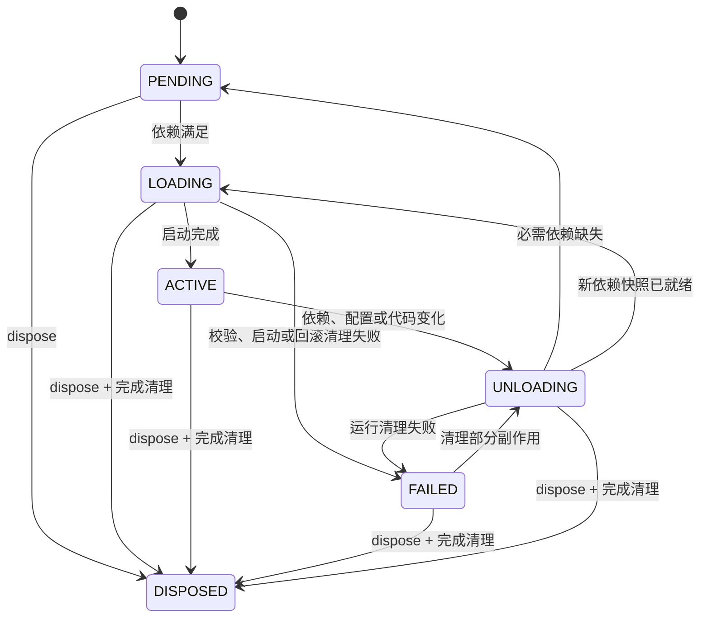

# Nya 核心设计

> 状态：Proposed<br>
> 类型：Specification<br>
> 适用范围：`@nya/core` 目标版本 0.1<br>
> 设计基线：Cordis 4.x 的时空可组合组件模型

本文记录 Nya 核心运行时的目标设计。状态为 Proposed 表示它可以指导讨论和实现，但不能单独证明某项能力已经存在；当前可观察行为以源码、导出类型、测试和[核心概念指南](./concepts.md)为证据。某段设计被接受后，实现、测试和公开 API 应逐步与其语义一致。

当前已落地 Component、Context、Fiber、Effect、Registry、最小 Service 基类、Inject、严格服务隔离、Service 调用方 Context 追踪、隔离事件过滤、Event 和同步 Config 生命周期。本文中的 Context 拦截、callable Service、mixin、Logger、Loader 和 HMR 仍是 Proposed，不应从目标设计推断它们已经可用。

Nya 借鉴 Cordis 的设计思想，但不以逐文件复制 Cordis 为目标。第一阶段追求的是复现它最重要的运行语义：上下文作用域、动态服务依赖、组件生命周期和副作用回收。

## 1. 要解决的问题

普通组件加载器通常只负责导入模块并调用入口函数，但真实应用还需要处理：

- 组件依赖的服务尚未出现；
- 服务被卸载、替换或隔离；
- 组件创建了监听器、定时器和连接；
- 配置或代码变化后需要安全重启；
- 一个组件安装多个子组件，并在卸载时级联清理；
- 异步启动、停止和依赖变化同时发生。

Nya 的目标是让组件可以被反复安装、停止和重新启动，并保证它产生的资源始终有明确的生命周期所有者。

### 1.1 目标

- 提供统一的组件定义和安装模型。
- 为每次组件安装创建独立的运行实例。
- 通过 Context 表达服务可见范围和局部覆盖关系。
- 通过 Fiber 管理一次组件实例的状态和副作用。
- 通过服务声明建立动态依赖关系。
- 当依赖、配置或代码发生变化时安全地停止并重启组件。
- 让事件监听、服务注册和子组件自动跟随组件卸载。
- 提供适合 TypeScript 模块扩展的类型接口。

### 1.2 非目标

- Nya Core 不负责具体业务领域。
- Context 隔离不是进程、权限或操作系统安全沙箱。
- Loader、配置文件、热重载和控制台日志输出不进入最小核心。
- 第一版不支持分布式组件生命周期。
- 第一版不要求兼容 Cordis 的内部数据结构或私有 API。
- 第一版不支持异步配置 Schema 校验。

## 2. 核心模型

一次组件安装由三个输入产生一个组件实例：

```text
组件定义 + 本次配置 + 父 Context = 组件实例
```

组件实例由两个互相关联但职责不同的对象表示：

```text
组件实例
├── Context：当前实例观察应用的作用域视图
└── Fiber：当前实例的状态、依赖快照和资源账本
```

可以进一步压缩为一句话：

> Context 负责“在哪里运行”，Fiber 负责“运行多久以及如何撤销”。

### 2.1 时空可组合

Nya 沿用 Cordis 的时空可组合思路。

“空间”描述能力在什么作用域内可见：

- 当前 Context 能看到哪个服务实现；
- 子 Context 如何继承或覆盖父 Context；
- 同名服务如何通过隔离标签形成多个作用域；
- 事件监听器是否属于当前作用域。

“时间”描述一个组件实例如何变化：

- 依赖何时满足；
- 组件何时启动；
- 依赖消失时何时停止；
- 配置变化时如何重启；
- 组件产生的资源如何完整撤销。

只有空间继承而没有生命周期回收，会留下泄漏的资源；只有启停机制而没有作用域，则无法正确表达局部服务和组件组合。Nya 必须同时实现两者。

## 3. 术语

| 概念 | 定义 | 是否对应一次安装 |
| --- | --- | --- |
| Component Definition | 可复用的组件蓝图，包括入口、依赖和配置模型 | 否 |
| Component Runtime | 某个组件定义在注册表中的运行元数据，可关联多个 Fiber | 否 |
| Component Instance | 组件定义使用一份配置安装一次所产生的实例 | 是 |
| Context | 当前组件实例观察服务、事件和框架能力的作用域视图 | 是 |
| Fiber | 组件实例的状态机、依赖快照和副作用所有者 | 是 |
| Effect | 创建资源并返回撤销方法的一次操作 | 属于一个 Fiber |
| Service | 组件提供给其他组件使用的具名能力 | 由 Fiber 提供 |
| Inject | 组件对所需服务能力的声明 | 属于组件定义或实例 |
| Registry | 组件定义、Runtime 和 Fiber 的索引 | 属于根 Context |
| Event | 组件之间的一对多消息 | 监听器属于 Fiber |

必须始终区分“组件定义”和“组件实例”。同一个定义可以用不同配置安装多次，每次安装都拥有独立的 Context 和 Fiber。

## 4. 用户编程模型

下面的代码代表 Nya 希望提供的核心体验。它同时也是后续实现的验收基线。

```ts
import { Context } from '@nya/core'
·······
interface Database {
  save(value: unknown): Promise<void>
  close(): Promise<void>
}

declare module '@nya/core' {
  interface Context {
    database: Database
  }

  interface Events {
    'record/created'(value: unknown): void
  }
}

const databaseComponent = {
  name: 'memory-database',

  apply(ctx: Context) {
    const database: Database = createDatabase()

    ctx.provide('database', database)

    return () => database.close()
  },
}

const consumerComponent = {
  name: 'consumer',
  inject: ['database'],

  apply(ctx: Context) {
    ctx.on('record/created', value => {
      void ctx.database.save(value)
    })

    ctx.effect(() => {
      const timer = setInterval(() => {
        ctx.emit('record/created', { time: Date.now() })
      }, 1000)

      return () => clearInterval(timer)
    })
  },
}

const app = new Context()
const consumer = app.installComponent(consumerComponent)

// consumer 此时缺少 database，保持 PENDING。
const database = app.installComponent(databaseComponent)

await Promise.all([database, consumer])

// database 消失后，consumer 会先清理自己的资源并回到 PENDING。
await database.dispose()
```

这个示例规定了以下语义：

- 组件可以在依赖出现之前安装。
- 缺少必需依赖的组件不会执行入口函数。
- 服务出现后，依赖它的组件会自动启动。
- 服务消失或被替换后，消费者会停止并清理当前运行产生的资源。
- 监听器、定时器和服务注册都归创建它们的 Fiber 所有。

## 5. Component Definition

### 5.1 支持的形式

Nya Core 参考 Cordis，支持函数、class 和带 `apply` 的对象组件。Registry 会把三者归一化为入口引用、名称与执行种类，再交给 Fiber 运行。

对象组件：

```ts
const component = {
  name: 'worker',
  inject: ['database'],
  Config,
  apply(ctx: Context, config: Config) {
    // 启动逻辑
  },
}
```

函数组件：

```ts
const component = (ctx: Context, config: Config) => {
  // 启动逻辑；可以返回 CleanupSource
}
```

class 组件：

```ts
class Component {
  constructor(ctx: Context, config: Config) {
    // 资源通过 ctx.effect() 登记
  }
}
```

函数和 class 直接以自身作为 Runtime 键，对象以 `apply` 作为 Runtime 键。构造器判定沿用 Cordis：具有 `prototype` 的普通函数按构造器执行，箭头函数、async 函数、生成器和异步生成器按函数执行。

### 5.2 组件元数据

组件定义可以携带：

```ts
interface ComponentMeta<Config = unknown> {
  name?: string
  inject?: Inject
  Config?: StandardSchemaV1<unknown, Config>
  provide?: string | string[]
  intercept?: Record<string, boolean>
}
```

- `name` 用于日志、调试和状态展示；函数和 class 默认使用 JavaScript 函数名，对象可以显式提供，缺失时显示为匿名组件。
- `inject` 声明当前组件运行所必需的服务。
- `Config` 校验并转换本次安装使用的配置。
- `provide` 可作为类服务或工具链的静态提示。
- `intercept` 为高级服务拦截机制保留。

### 5.3 返回值

组件入口的主要结果不是普通业务返回值，而是它对运行环境造成的变化。函数和对象 `apply` 允许返回 `CleanupSource`，供框架收集对应的清理函数：

- `undefined` 或 `null`；
- 一个清理函数；
- `Promise<清理函数 | void>`；
- 逐项产生清理函数的同步生成器；
- 逐项产生清理函数的异步生成器。

class 组件通过 `new` 启动，不收集构造结果；它应通过 `ctx.effect()` 登记需要回收的资源。

普通对象、数字或字符串等不属于合法的 `CleanupSource`，必须抛出类型错误。

## 6. Context

### 6.1 职责

Context 是当前组件实例的运行环境视图。它负责：

- 暴露 Nya 的基础能力；
- 按当前作用域解析服务；
- 保存隔离和拦截信息；
- 作为事件注册与派发的上下文；
- 指向当前 Fiber；
- 派生子 Context。

Context 不负责保存某个组件定义的全局状态，也不直接承担完整生命周期状态机；这些职责分别属于 Registry 和 Fiber。

### 6.2 根 Context

`new Context()` 创建一棵运行时树的根节点。根 Context 应初始化：

- 根 Fiber；
- Registry；
- 服务反射与解析系统；
- 事件系统；
- 日志服务；
- 根隔离映射和拦截映射。

根 Fiber 在稳定状态下处于 ACTIVE，并拥有安装在根 Context 上的组件。调用根 Fiber 的 `dispose()` 应卸载整棵组件树；清理期间它可以短暂进入过渡状态，但完成后仍可继续作为根作用域使用。

### 6.3 派生 Context

`ctx.extend(meta)` 使用原型链派生上下文，而不是复制父 Context：

```text
Root Context
    ↑
Component A Context
    ↑
Component B Context
```

派生上下文应满足：

- 未覆盖的属性从父 Context 继承；
- 局部元数据只影响当前节点及其后代；
- `root` 始终指向同一个根 Context；
- 类型层面保留具体 Context 子类型；
- getter、setter、Symbol 和属性描述符不应在派生时丢失。

每次 `ctx.installComponent()` 都必须基于父 Context 派生一个新的组件 Context，并把新 Fiber 放入该 Context。

### 6.4 代理访问

为了让用户可以写出 `ctx.database`，根 Context 应通过 Proxy 接管普通属性的读取、写入和存在性判断。

读取服务时必须：

1. 判断属性是否为框架自有属性；
2. 查找当前 Fiber 已确认的服务依赖快照；
3. 检查服务隔离标签；
4. 返回绑定到正确调用 Context 的服务值；
5. 在未声明依赖或依赖失效时给出明确错误。

Service 方法不能简单地脱离提供方 Context 调用。当前运行时会为消费者读取到的 Service 建立调用方绑定 Proxy：普通方法中的 `this.ctx` 是从调用方派生的混合 Context，其资源与空间能力属于调用方，Service 自身的依赖读取仍来自提供方 Fiber 的固定快照。普通 `provide()` 对象保持原值，不进入这套代理协议。

绑定不能通过临时修改原 Service 实例的 Context 实现，否则异步并发调用会互相覆盖。依赖调用方 `this.ctx` 的方法必须是 prototype 普通方法；箭头函数 class field 会词法绑定原实例，访问原生 `#private` 字段的 prototype 方法也无法以 Proxy 作为 `this` 执行。

### 6.5 Context 识别

`Context.is(value)` 应使用稳定的 Symbol 标记，而不是只依赖 `instanceof`。这样在同一进程加载多个 `@nya/core` 副本时仍能识别上下文。

建议使用带包名的全局 Symbol：

```ts
Symbol.for('@nya/core/context')
```

## 7. Fiber 生命周期

### 7.1 职责

每安装一次组件都创建一个 Fiber。Fiber 保存：

- 唯一实例编号；
- 父 Context 和当前组件 Context；
- 组件 Runtime；
- 已校验配置；
- 声明的依赖；
- 当前依赖实现快照；
- 当前状态；
- 当前异步启停任务；
- 本次运行产生的所有 Effect；
- 启动失败原因。

### 7.2 状态

```text
PENDING     等待依赖
LOADING     正在启动
ACTIVE      正常运行
UNLOADING   正在撤销本次运行
FAILED      配置校验、启动、运行清理或启动回滚失败
DISPOSED    实例已永久销毁
```

主要状态转换如下：



### 7.3 Epoch 与异步串行化

服务可能在组件异步启动过程中发生变化。Fiber 必须为当前依赖快照计算 epoch，并用一个 inertia 任务串行化启动与停止：

- 同一个 Fiber 的入口函数不能并发执行两次；
- 新依赖快照到来时，旧运行必须先完成清理；
- 异步生成器在 epoch 失效后不能继续登记新的长期资源；
- `await fiber` 必须等待当前所有启停任务稳定；
- 多次快速变化最终必须收敛到最新依赖和配置。
- 运行清理或启动回滚中的清理失败后，依赖通知不得自动启动新运行；必须由合法配置更新或显式重启解除阻塞。

epoch 可以由所有依赖实现所属 Fiber 的实例编号组成。任一服务实现变化都会产生新的 epoch，从而驱动消费者重启。

### 7.4 Thenable Fiber

`ctx.installComponent()` 返回 Fiber，同时允许直接等待：

```ts
const fiber = ctx.installComponent(component, config)
await fiber
```

`await fiber` 表示等待当前生命周期稳定，并不代表组件永久结束。如果组件启动失败，应拒绝并返回启动错误。

## 8. Effect 与资源回收

### 8.1 基本约定

凡是卸载组件时需要撤销的行为，都必须通过 Effect 登记，并返回对应的清理函数：

```ts
ctx.effect(() => {
  const timer = setInterval(run, 1000)
  return () => clearInterval(timer)
})
```

`ctx.effect()` 返回一个幂等的清理函数。无论手动调用还是由 Fiber 卸载触发，资源最多只能清理一次。

### 8.2 所有权

调用 `ctx.effect()` 时，Effect 必须登记到 `ctx.fiber`：

```text
Fiber
└── Effect
    ├── 创建资源
    ├── 子 Effect
    └── Disposer
```

以下 API 本身也必须通过 Effect 实现：

- `ctx.on()`；
- `ctx.provide()`；
- `ctx.installComponent()`；
- 定时器等扩展服务。

因此父组件卸载时会自然形成级联清理：

```text
父 Fiber 卸载
├── 卸载子组件
├── 移除事件监听器
├── 移除提供的服务
└── 关闭组件创建的资源
```

### 8.3 清理顺序与错误

- 单个 Effect 从 `CleanupSource` 收集到的清理函数按后进先出顺序执行。
- 清理函数允许返回 Promise。
- 某个清理函数失败时必须记录错误，并继续清理其他独立资源。
- 同一个清理函数重复调用不得重复执行。
- 已失活或已销毁的 Fiber 不得登记新 Effect。
- 组件启动中途抛错时，已经登记的 Effect 仍必须被清理。

## 9. Service 与动态依赖

### 9.1 服务是能力，不是组件身份

组件通过服务名称提供能力：

```ts
ctx.provide('database', database)
```

消费者声明所需能力：

```ts
consumer.inject = ['database']
```

消费者依赖的是 `database` 能力，而不是某个具体数据库组件。生产环境和测试环境可以提供不同实现。

### 9.2 注册规则

- 每个隔离作用域内，同一服务名称最多有一个有效实现。
- 服务实现必须记录提供它的 Fiber。
- `ctx.provide()` 返回幂等的移除函数，并自动属于当前 Fiber。
- 服务只有在提供方 Fiber ACTIVE 时才可作为有效依赖。
- 服务移除后必须通知所有声明了该依赖的 Fiber。

### 9.3 依赖驱动生命周期

`inject` 不是一次性的启动前检查，而是持续参与生命周期管理：

```text
服务不存在
    ↓
消费者 PENDING

服务出现并 ACTIVE
    ↓
消费者 LOADING → ACTIVE

服务消失或更换实现
    ↓
消费者 UNLOADING
    ↓
清理旧运行产生的全部资源
    ↓
PENDING 或使用新实现重新 LOADING
```

Fiber 启动时应保存服务实现快照。组件运行期间读取 `ctx.database` 时，得到的必须是当前 epoch 对应的实现，不能在一次运行中无感切换成另一个实现。

### 9.4 Service 基类

> 实施状态：部分 Current。最小基类、调用方 Context 绑定、隔离事件过滤、`Service.init` 和 `Service.check` 已实现；其余高级协议仍是 Proposed。

Nya 提供 Cordis 风格的 `Service` 基类，用于把类实例注册为服务：

```ts
class DatabaseService extends Service {
  constructor(ctx: Context) {
    super(ctx, 'database')
  }

  [Service.init]() {
    return () => this.close()
  }
}
```

`Service` 通过 Symbol 暴露框架协议。其中当前已经实现：

- `Service.init`：依赖满足后的初始化；
- `Service.check`：判断服务当前是否可用；
- `Context.filter`：Service 作为事件 `thisArg` 时按调用方的服务隔离地址过滤局部监听器；
- 调用方绑定：消费者读取 Service 时得到稳定 Proxy，普通方法的 `this.ctx` 指向调用方 Context；

后续高级协议包括：

- `Service.config`：服务拦截配置类型；
- `Service.invoke`：把服务实例变成可调用对象；
- `Service.extend`：创建保留服务上下文的派生对象。

callable Service、派生对象和 mixin 必须复用后续的调用方 Context 绑定机制，不能通过临时修改原 Service 实例的 Context 实现。

## 10. 服务隔离、调用方追踪与拦截

> 实施状态：部分 Current。服务寻址隔离、Service 调用方追踪及隔离事件过滤已实现；Context 拦截仍是 Proposed。

### 10.1 隔离

`ctx.isolate(name, label?)` 为某个服务名称创建局部解析空间：

```ts
const testContext = root.isolate('database')
testContext.provide('database', testDatabase)
```

隔离映射采用原型链继承：

```text
服务名称 + 隔离标签 = 服务实现键
```

- 未隔离的上下文共享 Root 内部为该服务名维护的默认标签。
- 服务名必须是非空字符串，显式标签必须是 Symbol。
- 未传入标签时创建新的唯一标签。
- 多个 Context 在同一 Root 中使用同一个标签时共享同一服务实现；不同 Root 始终隔离。
- 隔离严格匹配，缺失实现时消费者保持 `PENDING`，不得回退默认服务。
- `isolate()` 返回派生 Context，不修改父 Context、不创建 Fiber，也不形成独立生命周期边界。
- 服务依赖与 Service `thisArg` 事件过滤都遵守同一服务名的隔离标签。

### 10.2 调用方追踪与隔离事件

消费者读取 `Service` 时得到调用方绑定 Proxy。该视图应满足：

- 调用方 Context 决定方法中的 `this.ctx`、新建 Effect 的所有者和事件过滤空间；
- 提供方 Fiber 的固定快照决定 Service 可以读取哪些依赖，不能借调用方依赖绕过自身 `inject`；
- 同一调用 Context 重复读取同一实现时视图 identity 稳定，不同调用 Context 的视图互相独立；
- 普通 `provide()` 值不包装，保持引用 identity；
- Service 作为显式事件 `thisArg` 时，只派发到同一 Root、同一服务隔离标签的局部监听器；`global` 监听器跳过过滤；
- 调用代理不能临时修改原 Service 的 Context，并明确不支持依赖调用方 Context 的箭头函数 class field 或访问原生 `#private` 字段的方法。

这些边界记录在 [ADR-0004](./adr/0004-service-caller-context.md) 中。

### 10.3 拦截

`ctx.intercept(name, config)` 为局部上下文附加服务配置。服务可以沿拦截原型链合并配置，从而让父作用域提供默认值、子作用域覆盖局部值。

拦截改变服务在某个 Context 中的行为，不应直接修改服务的全局实例。

### 10.4 安全边界

隔离只控制 Nya 服务解析和事件过滤。组件仍运行在同一个 JavaScript 进程中，仍可访问文件系统、网络和环境变量。不可信组件必须使用进程、容器或其他真正的沙箱方案。

## 11. Registry

Registry 负责管理组件定义和运行实例。

对于每个归一化后的组件回调，Registry 保存一份 Runtime：

```ts
interface ComponentRuntime {
  name?: string
  kind: 'function' | 'constructor'
  callback: Function
  Config?: StandardSchemaV1
  fibers: Set<Fiber>
}
```

Registry 必须满足：

- 同一个组件定义可以拥有多个 Fiber；
- 每个 Fiber 使用独立配置和 Context；
- `registry.get(component)` 返回定义对应的 Runtime；
- `registry.delete(component)` 卸载该定义产生的所有 Fiber；
- 当最后一个 Fiber 被销毁后，可以删除对应 Runtime；
- 安装无效组件时立即抛出清晰错误；
- 子组件的 Fiber 必须作为父 Fiber 的 Effect 登记。

## 12. Event

事件用于表达“一件事情已经发生”，服务用于表达“调用某项明确能力”。二者不应混为一谈。

### 12.1 类型模型

事件类型通过模块扩展声明：

```ts
declare module '@nya/core' {
  interface Events {
    'record/created'(record: unknown): void
  }
}
```

### 12.2 派发模式

Nya 沿用 Cordis 的多种派发模式：

| API | 行为 |
| --- | --- |
| `emit()` | 同步依次调用全部监听器 |
| `parallel()` | 并行等待全部监听器，使用聚合错误报告失败 |
| `serial()` | 异步依次调用，在首个有效返回值处停止 |
| `bail()` | 同步依次调用，在首个有效返回值处停止 |
| `waterfall()` | 以 `next()` 组成可拦截的调用链 |
| `on()` | 注册跟随当前 Fiber 生命周期的监听器 |
| `once()` | 首次调用后自动移除的监听器 |

其中“有效返回值”指不是 `null`、`undefined` 或 `false` 的值。

### 12.3 上下文绑定

- 监听器归注册它的 Fiber 所有。
- Fiber 卸载后监听器必须自动移除。
- 监听器内部使用的是订阅方 Context，而不是事件发送方 Context。
- 服务或会话对象作为事件 `thisArg` 时，可以参与作用域过滤。
- `internal/*` 事件保留给 Nya 内部扩展点使用。

## 13. Config

> 实施状态：Current。同步 Standard Schema 校验、配置更新与 Fiber 重启已实现；Loader 整合仍是 Proposed。

组件可以提供符合 Standard Schema 的 `Config`：

```ts
const component = {
  Config,
  apply(ctx, config) {
    // config 已通过校验和转换
  },
}
```

规则如下：

- 配置在组件入口执行前校验。
- 校验结果可以填充默认值或转换数据。
- 未声明 Schema 时原样使用输入；当前只接受同步校验结果，Promise 结果会被明确拒绝。
- 校验 issue 使用导出的 `ValidationError` 暴露；初始校验失败时 Fiber 进入 FAILED，入口不得执行。
- `fiber.config` 暴露已校验、已转换的目标配置。
- `fiber.update(config)` 先校验新配置，失败时不修改旧配置和当前运行。
- 合法配置通过以 Fiber 为 `this` 的 `internal/update` waterfall 提供扩展机会。
- 更新生效时必须先清理旧运行，再使用新配置启动；多次快速更新最终收敛到最新配置。
- `fiber.restart()` 使用当前已验证配置重启 ACTIVE Fiber，或重试 FAILED Fiber；初始 Schema 失败时重新校验原始输入，也可以通过合法 `update()` 恢复，缺少依赖时保持 PENDING。
- DISPOSED Fiber 拒绝更新和重启；根 Fiber 仅支持清空 Effect 树并恢复 ACTIVE 的 `restart()`。

Loader 可以在 Core 之外负责读取 YAML 或 JSON、保存修改以及把配置条目映射为 Fiber。

## 14. 错误处理与日志

> 实施状态：部分 Current。Fiber 的失败隔离、错误暴露和回滚已有实现；Logger、结构化日志和 Effect 树诊断仍是 Proposed。

### 14.1 组件错误

- 一个组件启动失败只应使对应 Fiber 进入 FAILED。
- 已经登记的资源必须回滚。
- 其他无依赖关系的 Fiber 应继续运行。
- `await fiber` 应向调用者暴露启动错误。
- 错误同时交给当前 Context 的 logger。

### 14.2 清理错误

- 清理错误必须记录，但不得阻止其他资源继续清理。
- Fiber 的 `dispose()` 应尽可能完成所有清理并收敛到 DISPOSED。
- logger 本身失败属于无法在同一层再次记录的严重错误，可以向进程边界传播。

### 14.3 调试信息

每个 Effect 应携带可读标签，例如：

```text
ctx.on("record/created")
ctx.provide("database")
ctx.installComponent("worker")
ctx.timeout()
```

Fiber 应能暴露 Effect 树，用于诊断资源泄漏和组件卸载问题。Loader 还可以向错误栈追加配置条目位置。

## 15. 并发与一致性规则

Nya 的生命周期实现必须满足：

1. 同一个 Fiber 同一时间最多执行一个启动或停止阶段。
2. 依赖变化不能让一次运行同时使用新旧两个服务快照。
3. ACTIVE 之前提供的服务不能被消费者当作可用依赖。
4. 提供方停止时，应先通知并停止消费者，再完全移除消费者自访问所需的快照。
5. 多次 `dispose()` 必须幂等。
6. 父 Fiber 清理完成后，不得残留仍然 ACTIVE 的子 Fiber。
7. 异步 Effect 在失活后不得继续长期登记资源。
8. 多次快速配置或依赖变化必须最终收敛到最新状态。

这些规则应使用可控时钟和显式 Promise 的测试覆盖，不能只依赖人工运行示例。

## 16. 核心不变量

以下内容是 Nya 实现中不可破坏的约束：

- 每次非根组件安装恰好对应一个 Fiber 和一个派生 Context。
- 每个 Effect 恰好属于一个创建它的 Fiber。
- 每个组件实例只使用当前 Fiber 保存的依赖快照。
- 组件重新执行之前，旧运行产生的 Effect 必须完成清理。
- 组件启动失败后，不得留下该次启动产生的有效服务或监听器。
- 子组件的生命周期不能长于创建它的父组件实例。
- 服务实现的可见性同时由依赖声明和隔离标签决定。
- 服务实现变化必须驱动所有相关消费者重新计算生命周期。
- Registry 中的组件 Runtime 与具体组件实例不能混为一体。
- Context 派生不得修改父 Context。
- 根 Context、Registry、事件表和服务表必须属于同一棵运行时树。

## 17. 包与模块边界

### 17.1 `@nya/core`

只包含框架运行语义：

```text
packages/core/src/
├── context.ts       Context 创建、派生、隔离和拦截
├── symbols.ts       跨模块协议 Symbol
├── disposable.ts    幂等清理集合与 CleanupSource 类型
├── fiber.ts         生命周期状态机和 Effect 执行
├── registry.ts      组件归一化、Runtime 和安装
├── reflect.ts       Context Proxy 与服务解析
├── service.ts       Service 基类和服务协议
├── events.ts        事件注册与派发
├── logger.ts        日志接口和缓冲
└── index.ts         公开导出
```

文件划分可以随实现调整，但职责边界必须保持。

### 17.2 后续扩展包

与 Cordis 类似，下列能力应保持为 Core 之外的组件：

```text
@nya/loader          动态导入模块和管理配置条目树
@nya/include         读取及写入 YAML/JSON 配置
@nya/group           组织嵌套组件组
@nya/hmr             文件监听、模块缓存和热替换
@nya/timer           生命周期安全的 timeout/interval/debounce
@nya/logger-console  控制台日志输出
create-nya           项目脚手架
```

这种分层保证 Core 不依赖文件系统、YAML、文件监听器或 Node 私有模块加载器。

### 17.3 代码文件总注释规范

每一个手写代码文件都必须在文件第一行提供一段中文文件级总注释，用一句简洁的话说明该文件的主要职责和边界。

- 文件级总注释必须位于 `import`、导出或其他代码之前。
- 注释应说明“这个文件负责什么”，不需要复述具体实现步骤。
- 注释主体使用中文，但 `function`、`object`、Context、Fiber、Effect、Runtime 等技术名词保留英文，不强制翻译。
- 测试文件同样需要说明它主要验证的行为。
- 编译产物、依赖代码和其他自动生成文件不要求手工添加或维护该注释。

## 18. 实现顺序

实现不应按照“把所有文件先建出来”的方式推进，而应逐步完成可测试的纵向闭环。

### 阶段一：组件实例与清理

> 实施状态：Current。

实现：

- 根 Context；
- Component 与 Registry；
- Fiber 基础状态；
- `ctx.installComponent()`；
- `ctx.effect()`；
- 幂等和级联清理。

验收示例：组件可以启动、返回清理函数、安装子组件并完整卸载。

### 阶段二：服务与动态依赖

> 实施状态：Current。

实现：

- `ctx.provide()`；
- `inject`；
- Context Proxy；
- 服务快照；
- 依赖出现、消失和替换时的自动启停。

验收示例：消费者先于提供方安装；提供方出现后启动，消失后消费者清理并回到 PENDING。

### 阶段三：事件与配置

> 实施状态：部分 Current。Event 和配置生命周期已完成；Logger 仍未实现。

已实现：

- `on`、`once` 和各派发模式；
- Standard Schema 配置校验；
- `fiber.update()` 和 `restart()`；
- Fiber 启动失败隔离、错误暴露与回滚。

尚未实现：

- Logger、结构化日志和 Effect 树诊断。

### 阶段四：空间组合

> 实施状态：部分 Current。服务隔离、调用方追踪、隔离事件过滤和最小 Service 基类已完成，其余能力仍是 Proposed。

已实现：

- 服务隔离；
- Service 调用方 Context 追踪；
- Service `thisArg` 隔离事件过滤；
- 最小 Service 基类、`Service.init` 与 `Service.check`。

尚未实现：

- Context 拦截；
- callable Service、高级 Service 协议和 mixin。

### 阶段五：外围生态

> 实施状态：Proposed。

实现 Loader、Include、Group、Timer 和 HMR。外围包只能依赖 Core 的公开协议，不得通过修改 Core 私有状态工作。

## 19. 最小测试矩阵

### Component

- 函数、class 和带 `apply` 的对象组件都可以安装。
- 函数 / class 名称自动推断，缺少 `name` 的对象允许安装为匿名组件。
- 生成器和异步生成器走函数路径，具有 `prototype` 的普通函数走构造器路径。
- 无效组件立即报错。
- 同一定义可以安装多次。
- 子组件随父组件卸载。
- 已销毁 Context 不能创建组件或 Effect。

### Effect

- 同步、Promise、生成器和异步生成器均可登记清理函数。
- 清理顺序正确。
- 手动清理和 Fiber 清理均幂等。
- 启动中途失败时已登记资源被回滚。

### Fiber

- 状态转换符合设计。
- 依赖快速变化时不会并发执行入口。
- `await fiber` 等待状态稳定。
- 配置更新只使用最新配置。

### Service

- 缺少依赖时消费者保持 PENDING。
- 服务 ACTIVE 后消费者才启动。
- 服务移除后消费者停止。
- 服务更换后消费者先清理再重启。
- 默认实现与隔离实现不能互相满足依赖。
- 使用同一显式标签的 Context 分支共享服务地址。
- 不同 Root 即使复用同一 Symbol 也保持隔离。
- 同一隔离标签不能重复提供同名服务。
- Service 方法获得调用方 Context，同时依赖读取仍固定在提供方快照。
- 普通 `provide()` 对象不被调用代理包装。
- 两个异步调用方不会互相覆盖 Service Context。

### Event

- 监听器随 Fiber 清理。
- `emit`、`parallel`、`serial`、`bail` 和 `waterfall` 行为一致。
- 监听器使用订阅方 Context。
- Service 作为 `thisArg` 时，隔离过滤不会把事件发送到错误作用域。
- `global` 监听器跳过 Service 隔离过滤。

## 20. 当前实现与目标设计的衔接

当前 `packages/core/src/context.ts` 已经不再是只验证原型链的原型。已落地的运行时基础包括：

- 使用 `@nya/core` 命名空间的全局 Symbol 识别 Context；
- 使用原型链派生子 Context，并保护 `root`、Fiber、Registry 等核心引用；
- 根 Context 初始化 Fiber、Registry、ServiceRegistry 和 EventRegistry；
- Context Proxy 提供已声明服务的属性访问；
- Component、Fiber、Effect、Service、Inject 和 Event 已接入同一套所有权与动态依赖生命周期；
- 服务名与隔离标签共同定位服务 slot，隔离缺失时严格保持 PENDING；
- Service 调用方 Context Proxy 与隔离事件过滤已实现；
- 最小 Service 基类、`Service.init` 和 `Service.check` 已实现；
- Standard Schema 同步校验、`fiber.update()`、`restart()` 和快速配置更新收敛已实现。

当前与本文目标之间的主要差距是：

- Context 拦截；
- callable Service、高级 Service 协议和 mixin；
- Logger、结构化错误上报和 Effect 树诊断；
- Loader、Include、Group、Timer 和 HMR 等外围生态。

因此，后续应当在已有生命周期协调器上继续完成空间组合和可观测性，而不是从阶段一重新开始。

## 21. 设计结论

Nya Core 的本质不是模块导入工具，也不是简单的依赖注入容器。它是一个由依赖变化驱动、能够完整撤销组件副作用的作用域运行时。

最终心智模型如下：

> 组件定义是可复用蓝图。
>
> 每次安装产生独立的 Context 和 Fiber。
>
> Context 决定当前实例能看到什么。
>
> Fiber 决定当前实例何时运行并拥有全部副作用。
>
> Service 建立动态依赖，Event 提供一对多协作。
>
> 当依赖、配置或代码变化时，Nya 先撤销旧运行，再组合出新的运行状态。
